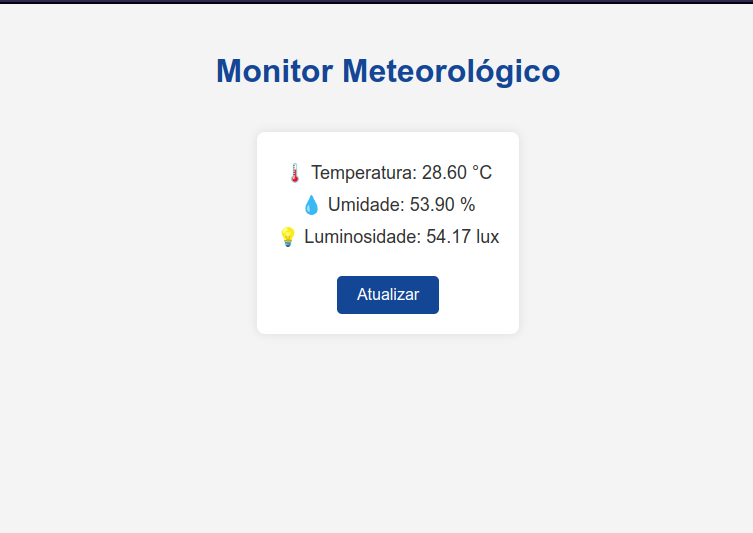

# 📡 EMBARCATECH\_IOT – Estação Meteorológica IoT com Raspberry Pi Pico W

[](https://drive.google.com/file/d/1hPMVfmyAU50Igy2V2hlSBTcgzZ9rx6SJ/view?usp=sharing)

## 📝 Resumo

Este sistema de monitoramento meteorológico foi projetado para operar de forma independente, sem a necessidade de serviços de terceiros ou plataformas de computação em nuvem. Ele oferece controle local completo, acesso a dados em tempo real e uma arquitetura eficiente e transparente.

## 📜 Descrição

Este projeto implementa uma mini estação meteorológica utilizando a **Raspberry Pi Pico W**, exibindo os dados em um **display OLED** e os disponibilizando via **servidor web embutido**. Os dados coletados incluem:

* 🌡️ Temperatura (sensor DHT22)
* 💧 Umidade relativa do ar (sensor DHT22)
* 💡 Luminosidade (sensor BH1750)

Tudo isso acessível via **interface web moderna** ou por requisição **HTTP GET** no formato **JSON**, sem nenhuma dependência de plataformas externas.

## 🧰 Componentes Utilizados

* Raspberry Pi Pico W
* Sensor DHT22 (Temperatura e Umidade)
* Sensor BH1750 (Luminosidade)
* Display OLED 128x64 (Driver SSD1306)
* Conexão Wi-Fi (via chip CYW43)
* Barramento I²C (dois canais independentes)

## 🧠 Funcionalidades

* Leitura periódica dos sensores (luminosidade a cada 2s, temperatura e umidade a cada 3s)
* Exibição em tela OLED (I²C)
* Servidor TCP (porta 80) com:

  * Página HTML elegante e responsiva
  * Endpoint `/dados` para leitura de sensores via JSON
* Conexão automática à rede Wi-Fi
* Logs de requisições HTTP no console serial

## 🌐 Acesso Web

Após a conexão Wi-Fi ser estabelecida, o dispositivo imprime o endereço IP via serial.

Acesse pelo navegador:

* `http://<IP_DO_DISPOSITIVO>/` – Interface gráfica HTML
* `http://<IP_DO_DISPOSITIVO>/dados` – Resposta JSON:

```json
{
  "temperatura": 25.30,
  "umidade": 55.40,
  "luminosidade": 235.00
}
```

## ⚙️ Estrutura do Código

```
.
├── Embarcatech_IOT.c               # Código principal
├── lib/
│   ├── lwipopts.h # Configurações para a internet
│   ├── font.h # Cabeçalho com as fontes para o display OLED
│   ├── ssd1306.c/h      # Driver para display OLED
│   ├── bh1750.c/h       # Driver do sensor de luminosidade
│   └── dht22.c/h        # Leitura do sensor de temperatura/umidade
├── CMakeLists.txt       # Build system para a Raspberry Pi Pico
└── README.md            
```

## 📡 Wi-Fi

Configure seu SSID e senha no `main.c`:

```c
#define WIFI_SSID "SEU_WIFI"
#define WIFI_PASSWORD "SUA_SENHA"
```


## 🛠️ Compilação

Certifique-se de ter o SDK da Pico instalado. Compile com:

```bash
mkdir build
cd build
cmake ..
make
```

Grave o firmware na Pico W via UF2 ou `openocd`.

## 📷 Screenshot

Adicione uma imagem capturada da interface web ou do dispositivo em funcionamento para ilustrar o projeto. Por exemplo:




## 📖 Referências

* [Datasheet do DHT22](https://cdn.sparkfun.com/datasheets/Sensors/Temperature/DHT22.pdf)
* [Datasheet do BH1750](https://www.mouser.com/datasheet/2/348/bh1750fvi-e-186247.pdf)
* Pico SDK e exemplos oficiais da Raspberry Pi

## 🏛️ Licença

Este projeto está licenciado sob a Licença MIT. Você é livre para usar, modificar e distribuir o código, desde que mantenha os devidos créditos aos autores originais. Consulte o arquivo de licença para mais detalhes.
